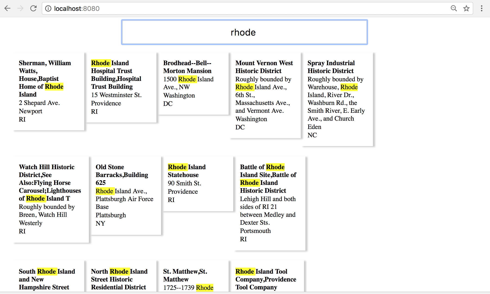

# InstantSearch
This application demos how to build an Autocomplete/Search Solution.

### Context
ITA Software now part of Google are well knownfor their tough Hiring puzzles. This was built as a solution to the problem below

#### Problem Description:

Write a Java web application which provides "instant search" over properties listed in the National Register of Historic Places. Rather than waiting for the user to press a submit button, your application will dynamically update search results as input is typed. We provide the file nrhp.xml.gz, http://www.itasoftware.com/careers/work-at-ita/PuzzleFiles/nrhp.xml.gz which contains selected information from the register's database.

Database The key component of your server-side application is an efficient, in-memory data structure for looking up properties (written in pure Java). A good solution may take several minutes to load, but can answer a query in well under 0.1 ms on a modern PC. (Note that a sequential search of all properties is probably too slow!) An input matches a property if it is found at any position within that property's names, address, or city+state. Matches are case-insensitive, and consider only the characters A-Z and 0-9, e.g. the input "mainst" matches "200 S Main St" and "red" matches "Lakeshore Dr." Note that the server's JVM will be configured with 1024M maximum heap space.

### Implementation
Key to this solution is making use of Tenary Search Tree to efficiently store data and do fast prefix string searches (https://en.wikipedia.org/wiki/Ternary_search_tree)

### Components
The solution is made up of the following components.

1. SearchRest Interface: Built using SpringBoot and Spring MVC
2. SearchDatabase: Implemented with a Tenary Search Tree and a HashMap.
3. WebInterface: Built with React

### Building and Running
* Install Prequistes if not already installed (Java 1.8 and Maven)
* Clone repository
* cd into folder.
* Run ./mvnw spring-boot:run
* Navigate to http://localhost:8080
* Make Searches: eg "Bos", "Rhode Island" etc

### SearchPage

